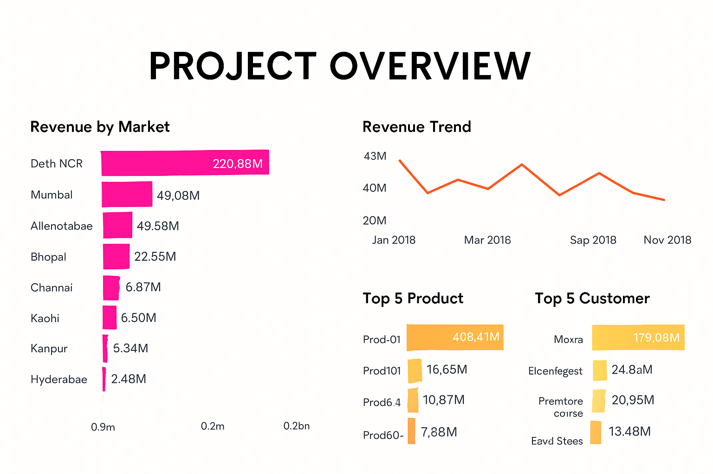
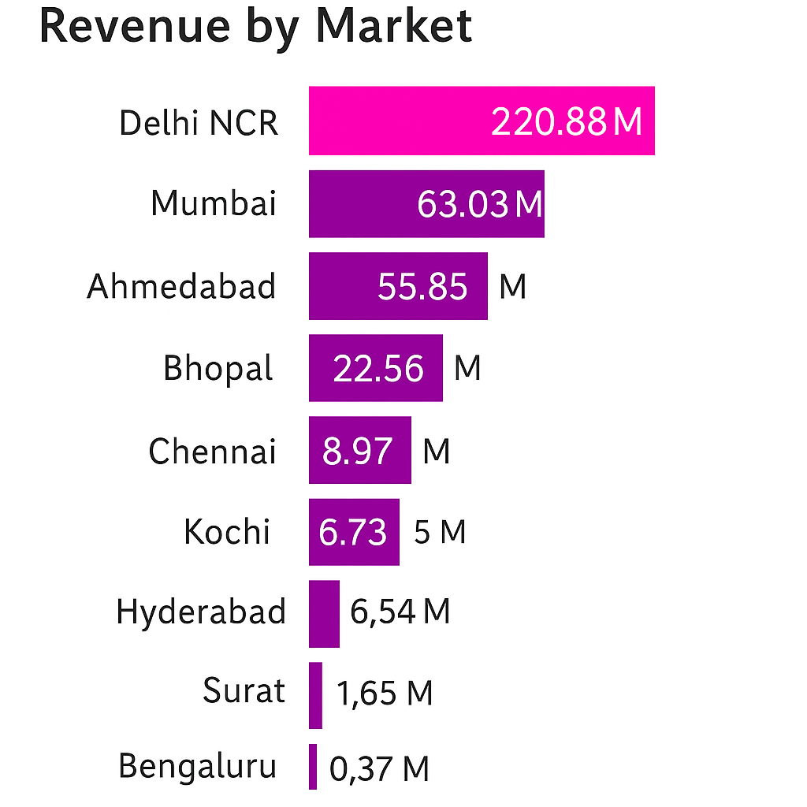
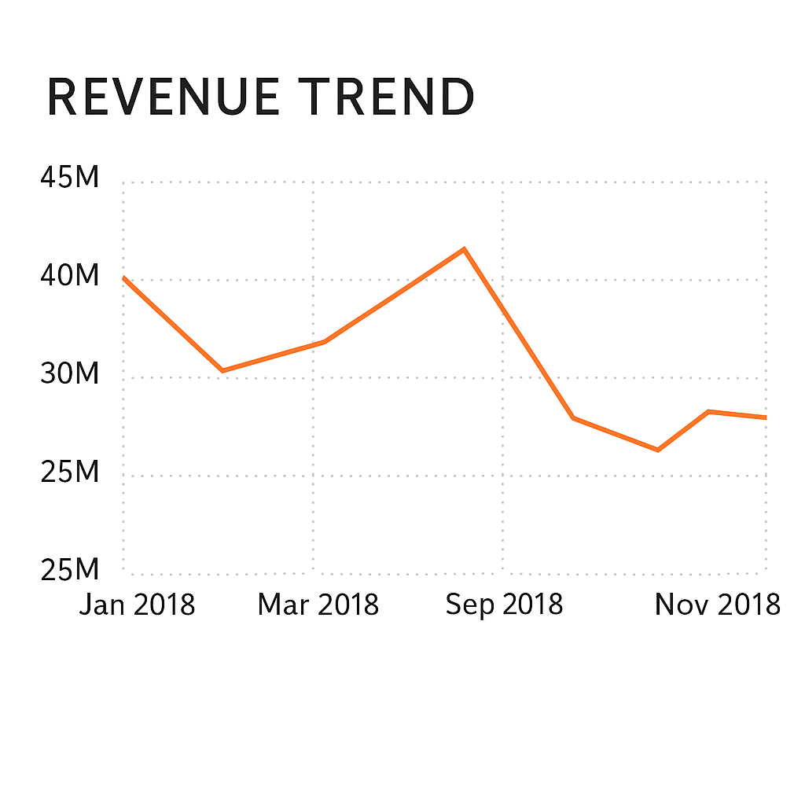
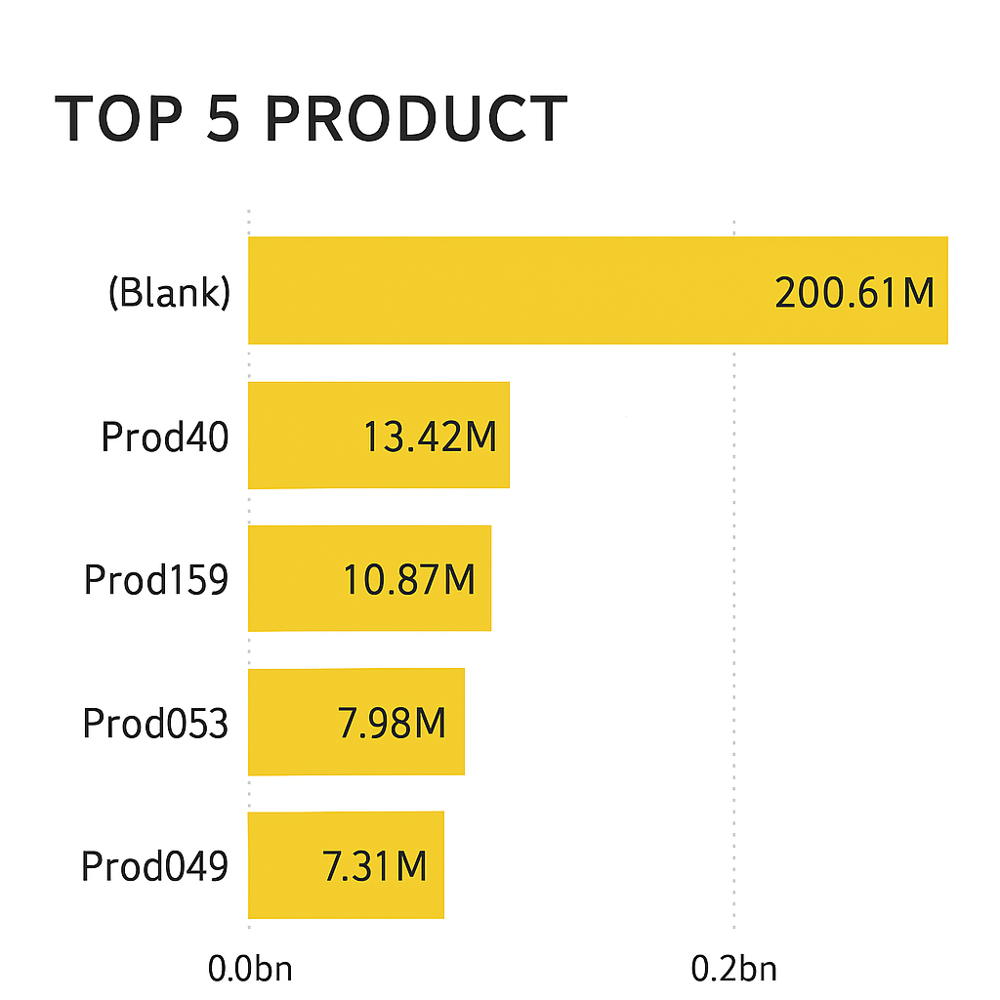

# 💼 Power BI Sales Dashboard – Computer Hardware Industry

## 🎯 Project Purpose, Stakeholders & Success Criteria

**Purpose**  
To unlock sales insights that were not visible before for the sales team and automate data gathering to reduce manual time.

**End Result**  
An automated dashboard providing quick and updated sales insights to support data-driven decision-making.

**Stakeholders**  
- Sales Director  
- Marketing Team  
- Customer Service Team  
- Data & Analytics Team  
- IT Team

**Success Criteria**  
- Dashboards uncovering sales order insights with the latest data  
- Sales team improves decision-making and proves 10% cost savings  
- Sales analysts save 20% of business time by automating data gathering and reinvest it in high-value activities

---

## 📊 Dashboard Highlights

### 📌 Revenue by Market

### 📌 Revenue Trend

### 📌 Top 5 Product

### ✅ KPI Cards
- **Total Sales**
- **Average Order Value**
- **Total Transactions**

### 📆 Sales Trends
Line chart showing monthly sales trends with interactive slicers for region, category, and product.

### 🏆 Top Performing Products
Horizontal bar chart displaying top 5 products based on total revenue.

### 🌍 Regional Performance
Map and bar chart showcasing sales by region to evaluate performance across markets.

### 🍩 Category Distribution
Donut chart representing sales contribution across product categories like Laptops, Accessories, Components.

---

## 🧠 Key Insights

- Laptops dominate total sales (>40%)
- North region underperforming — requires sales attention
- Seasonal spikes observed in Q4 due to bundled promotions

---

## 🚀 How to Explore

> Open the `Sles_PowerBi.pbix` file in Power BI Desktop and use slicers to:
- Filter by Product Category
- Drill down into Regional or Monthly data
- Compare trends between years

---

## 📁 Files Included

| File | Description |
|------|-------------|
| `SalesInsight_PowerBi.pbix` | Full Power BI dashboard |
| `ChatGPT Image Jun 17, 2025, 12_46_38 PM.png` | Project summary image (Purpose, Stakeholders, Success Criteria) |
| `README.md` | This project report |

---

## 📌 Author

**[Riddhi Singh]**  
Connect on [https://www.linkedin.com/in/riddhi-singh-827917250/](#)

